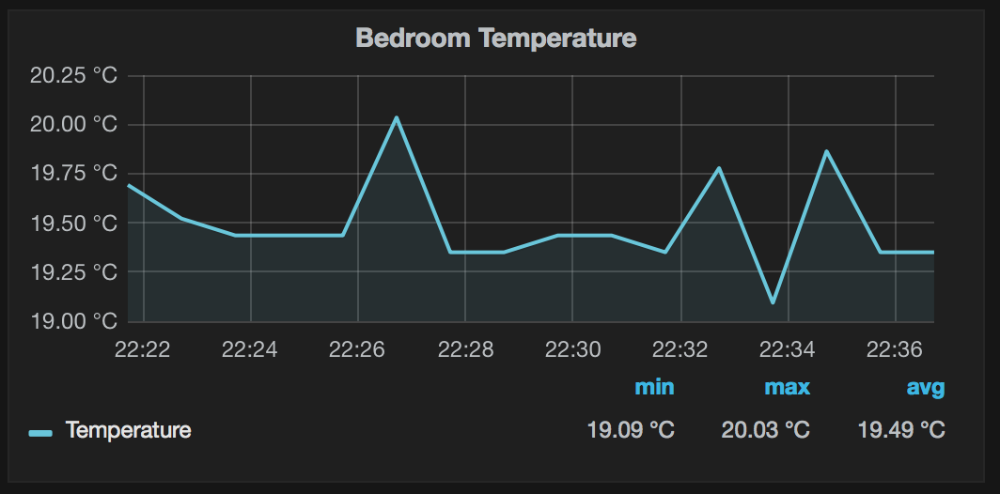

# IoT Edison exporter

[Prometheus](http://prometheus.io) exporter for sensor metrics from [Intel Edison](https://software.intel.com/en-us/iot/hardware/edison).  

Currently, Grove temperature sensor is only supported.

### Build and run

Build on a machine using Go 1.5+ with GOPATH set:

    git clone https://github.com/roman-vynar/edison_exporter.git
    cd edison_exporter
    go get -d
    GOARCH=386 GOOS=linux go build edison_exporter.go

Copy to Edison:
    
    scp edison_exporter root@<Edison IP>:~/
    
Run:

    root@edison:~# ./edison_exporter

### Options

Name                              | Description
----------------------------------|------------------------------------------------------------------------------------
-web.listen-address               | Address to listen on for web interface and telemetry. (default ":9122")
-web.telemetry-path               | Path under which to expose metrics. (default "/metrics")
-log.level value                  | Only log messages with the given severity or above. Valid levels: [debug, info, warn, error, fatal, panic]. (default info)
-sensor.celsius-scale             | Whether to use Celsius scale, otherwise - Fahrenheit. (default true)
-sensor.temperature.interval      | Temperature sensor polling interval. (default 5s)
-sensor.temperature.pin           | Pin number where temperature sensor is attached. (default 0)

### Samples

Output:

    # HELP edison_exporter_scrapes_total Total number of scrapes.
    # TYPE edison_exporter_scrapes_total counter
    edison_exporter_scrapes_total 11
    # HELP edison_exporter_up Was the last scrape of sensor data successful.
    # TYPE edison_exporter_up gauge
    edison_exporter_up 1
    # HELP edison_sensor_temperature Current temperature.
    # TYPE edison_sensor_temperature gauge
    edison_sensor_temperature 21.321115976961153

Graph with Grafana:

